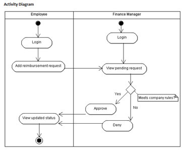

# Center of Excellence
### Overview - ERS Project Requirements V3

This document is meant to provide an overview of all deliverables for the entire full stack foundations project, designed to test the implementation capabilities of the associates and help guide them into their technology projects. The entire project is mapped over 3 weeks.

This project is an expense reimbursement system, designed to allow each associate to demonstrate their understanding of the fundamentals of software development. Employee expense reimbursement software allows you to input expenses for approval through one application. In short, you are building an API (Application Programming Interface) for employees to submit reimbursement requests and managers to approve or deny the submitted requests.

### Project Setup
(These should be done before any feature development)
The project setup is vital to the success of the first project. Ensure that these steps are completed before any feature development takes place. Utilizing the steps below to prepare for development can increase the probability of success and decrease stress levels. Here are the steps to follow:

1.	Set up a GitHub Repository for the project
Establish a Project 1 remote repository in GitHub. This is vital to your success with this project and will help reinforce skills with Git and version control.
•	Set up repository for Project 1
•	Clone to your computer and initialize
•	First Commit
•	First Push

2.	Understand the use-cases of the ERS system
Any good developer needs to understand what the requirements are really asking. When starting from scratch, it is imperative that a developer begins with a plan for the user experience and an outline of the functionality requirements. Review the diagram below:
  

### Functional Requirements
This project’s purpose is to allow associates to develop features in a self-guided environment. Completion of this project will finalize a working ERS application before the foundations project presentation. The main goal is to build the application into a working API that satisfies all the core functionality required.

Core MVP Features:
1.	**Login/Register Feature**
The login/register feature is meant to give you preliminary experience handling authentication within an application. These features allow you to ensure you can track or maintain who can connect to your application. Here are the user stories:
  -	As an Employee or Manager, I should be able to log into the application.
    -	Must be able to log in with an email and password
  -	Ability to register a new account 
    - You must ensure the email is not already registered 
    - Default to an employee role 
    - Should register with at least an email and password
Here is a link to all the support content that is provided for this phase 1 feature:
[Login/Register Feature Support](https://drive.google.com/drive/folders/1xcT_tf9ZunLrJ8jGtwemT5JhRZlpbo56?usp=sharing)

2.	**Submit Ticket Feature**
The submit ticket feature is meant to guide you through input acceptance, validation, and error handling. The ability to submit a reimbursement request ticket is the core functionality of this application. Here is the user story:
 - Employees can submit a new reimbursement ticket 
   - Must have an amount 
   - Must have a description 
   - Should have a default status of Pending
Here is a link to all the support content that is provided for this phase 1 feature:
Submit Ticket Feature Support

3.	**Ticketing System Feature**
The ticketing system feature is meant to act as the primary interface for internal managers. Managers will use this interface to process the pending reimbursement request tickets and either approve or deny these requests. Here is the user story:
 - Managers can process tickets submitted by employees 
   - Tickets can be Approved or Denied 
   - Tickets cannot change status after processing 
 - Pending tickets should be added to a queue or list that managers can see 
   - Tickets should be removed from the list, or queue, once processed (approved/denied) by a manager

4.	**View Previous Tickets Feature**
The view previous tickets feature is meant for employees to see their request submission history. Employees will leverage this to see outstanding pending tickets along with tickets that have been processed by managers. Here is the user story:
 - As an Employee, I should be able to view all previous reimbursement ticket submissions. 
   - Employees should be able to filter by status (pending, approved, or denied)
   - Previous tickets should also show the details of submission.

### Checklist for Feature Development
**Developing features of an application can be a complex process; however, each implementation should follow a generalized process:**
 - Understand what this feature is meant to do
 - Outline a plan to implement this feature's functionality
 - Start writing code
 - Complete the development of this feature
 - Validate the required functionality works
 - Commit and push the code to a GitHub repository

### Completion Checklist
The checklist below is the project evaluation standard.
This list will be utilized during the project presentation to demonstrate that the application meets all the functionality requirements.
Using Postman or Swagger, make sure the application can complete the following tasks:
1.	Can use a username and password to log in
2.	Can register a new account with username and password
3.	Will notify the user if the username is unavailable
4.	Can submit new reimbursement tickets
5.	Will make sure the reimbursement ticket author provides a description and amount during submission
6.	Pending tickets are in a queue/list that can only be seen by Managers
7.	Tickets can be processed (approved or denied) by Managers
8.	Employees can see a list of their previous submissions

### Project Presentation
At the end of this project, you will be required to give a professional presentation. In this presentation, you should cover the technologies utilized, architecture diagram, ERD diagram, list of features Implemented, outstanding defects/issues, challenges faced, and give a thorough project demo. Ensure that you are dressed in business professional attire and can articulate how you built the application you are presenting. You will need to show that http requests can reach the API and the appropriate functionality and endpoints exist through postman or swagger.

### Optional Stretch Goals 
(Only work on these after the requirements have been completed)
These features are possible extensions to the application. If there is extra time after finishing the core requirements, these features will give good implementation practice leading into Project 2. Refer to the features below to see the options:
Optional Stretch Features:
1.	Reimbursement Types Features
 - Employees can add Reimbursement Types  
  - Travel, Lodging, Food, Other 
  - Employees can view previous requests filtered by type
2.	Change Roles Feature
 - Managers can change other users’ roles
  - Employee to Manager or back to Employee
3.	Upload Receipts Feature
 - Employees can add images of receipts to their reimbursement requests
  - Upload and store images (in SQL or cloud storage)
4.	User Accounts Feature
 - Track additional user information (name, address, etc.) 
 - Users can edit their account 
 - Users can add a profile picture
