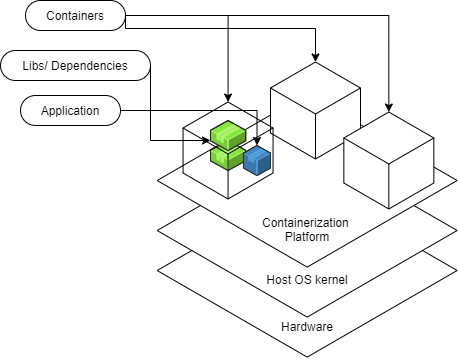

## Description

A **container** is a mechanism for packaging an application (or limited number of processes) with its dependencies so that it runs in its own isolated sandbox. 

Containerization helps to ensure the application or set of processes can run safely. The container shouldn't be able to modify or interact with anything it doesn't need to, and changes in the container should not affect the Host or other containers. 

Containerization helps to ensure the application or set of processes can run reliably regardless of the host environment. The software can be bundled into a container along with all of the other software it depends on. This includes libraries, frameworks, applications, assets, and even operating systems.

Containers are lightweight portable software bundles that support and isolate the software packaged inside.

The following diagram illustrates the structure of containers- an application in a container is isolated to just what it needs.

Containers started out utilizing Linux kernel features that allowed them to monitor and control access to system resources. Eventually Microsoft built their own solutions, partnering with Docker to achieve the same functionality and portability on Windows as on Linux. With the Windows Subsystem for Linux (WSL) installed, the Docker engine can run on Windows, and can support any Docker container.

Docker is perhaps the best known containerization solution. There are alternatives, but the content in this curriculum will focus primarily on Docker containers.

