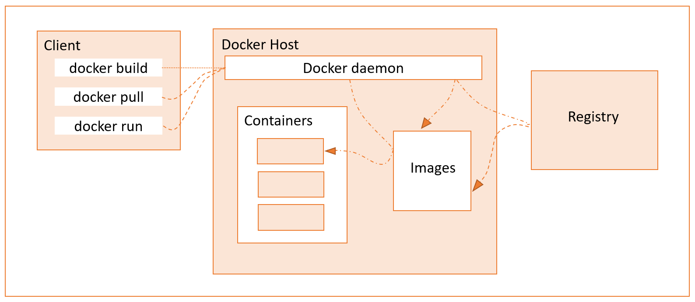

## Description

**Docker Architecture**
Docker adheres to a Client-Server Architecture. The client allows you to run commands and interact with the docker objects managed by the docker daemon, which is in effect the server. 

This architecture, consequently, translates into these *primary* components that allow you to run and interact with Dockerized applications (applications that have been packaged up and run in Docker containers.)
- [Docker Daemon](#docker-daemon) 
- [Rest API](#rest-api)
- [Docker CLI client](#docker-cli-command-line-interface-client)
- [Docker Registries](#docker-registries)
- [Docker objects](#docker-objects)  

As you can see from the diagram the *client* includes the commands that manage docker containers and images. The *docker host* is the computer on which the *docker daemon* runs, and the *docker daemon* is responsible for managing the *docker objects* i.e. containers and images. The *registry* is an additional/optional component that provides a centralized place to share docker images. Finally, while the *REST API* is not labeled in the diagram it's effectively the lines connecting the *client* and *docker daemon*.   